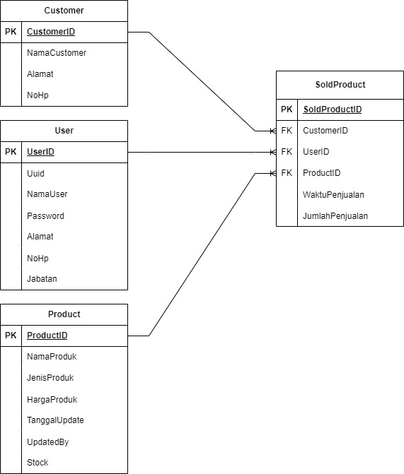

# Name:  Daniel Hartanto

1. **User Table**:

   - table ini untuk pengguna sistem seperti admin
   - terdiri dari id user, uuid untuk menjadi token,nama user,password, alamat,nomor hp, jabatan

2. **Product Table**:
   
   - table ini berisi produk yang dijual beserta harga dan stocknya.
   - terdiri dari id produk, nama produk, tanggal perubahan,updated by, harga produk,  stock/ jumlah produk 
   - tanggal perubahan digunakan untuk mengetahui kapan stock terakhir kali ditambahkan
   - updated by digunakan untuk penanggung jawab siapa yang telah menambahkan stock terakhir kali
   - stock/jumlah produk digunakan untuk mengetahui sisa produk agar tidak kekurangan saat penjualan
   - stock auto berkurang saat customer membeli produk tersebut menggunakan trigger
     
3. **Customer Table**:

   - tabel ini berisikan data diri customer.
   - terdiri dari id customer,nama customer, alamat, nomor hp

4. **Sold Product Table**:
   - table ini digunakan untuk menyimpan data setiap pembelian produk terjadi
   - table ini berguna untuk melihat penjualan harian maupun penjualan per user maupun penjualan per produk 
   - terdiri dari id user foreign key table user, id customer foreign key table customer,id produk foreign key table produk, waktu penjualan, jumlah penjualan

## Script query SQL berada di folder script_create_database
isi script query sql :
   - drop table jika ada dan membuat table user,product,customer,sold product
   - membuat trigger untuk auto mengurangi stock setiap pembelian produk
   - membuat sampel data
   - query select untuk menampilkan sisa stock
   - query select untuk mencek penjualan berdasarkan hari
sampel user yang bisa diakses:
-nama: Daniel password: 123
-nama: Daniel Hartanto  password:123
## bentuk cara kerja api

   
   - pertama tama menggunakan api login untuk mendapatkan token
   - akses api yang lain menggunakan token yang diberikan

## API yang tersedia berjalan di localhost:3000
1. POST("/api/login")
   - Api ini digunakan untuk login 
   - memerlukan nama user dan password
   - mengembalikan header dan body UUID yang digunakan untuk token 
2. POST("/insert_product")
   - api ini digunakan untuk memasukan produk baru
   - api ini memerlukan token 
   - produk baru tidak boleh memiliki produk yang sama dengan yang lama
   - memerlukan nama produk,jenis produk, harga produk, updated by stock 
   - api ini tidak mengembalikan apapun
3. GET("/list_product")
   - api ini digunakan untuk memlist produk yang tersedia
   - api ini memerlukan token
   - api ini tidak memerlukan apapun
   - mengembalikan list produk
4. PATCH("/update_stock")
   - api ini digunakan hanya untuk mengubah stock yang ada
   - api ini memerlukan token
   - api ini memerlukan product id dan jumlah stock yang akan terganti
   - api ini tidak mengembalikan apapun
## sampel input api Postman_TesMKP.postman_collection.json (untuk insert produk bisa menggunakan nama lain karena dibuat unique
